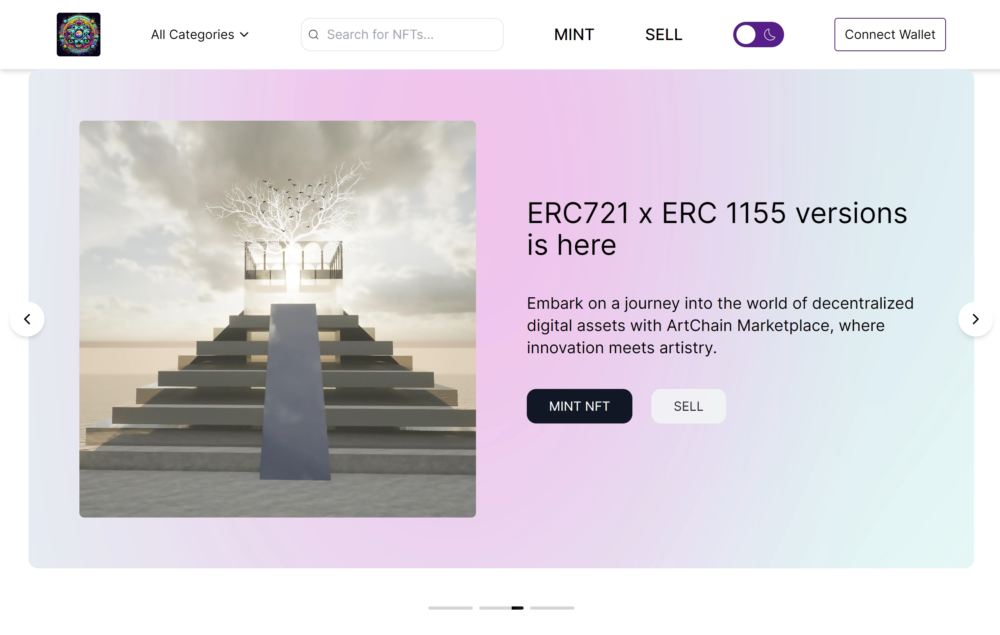
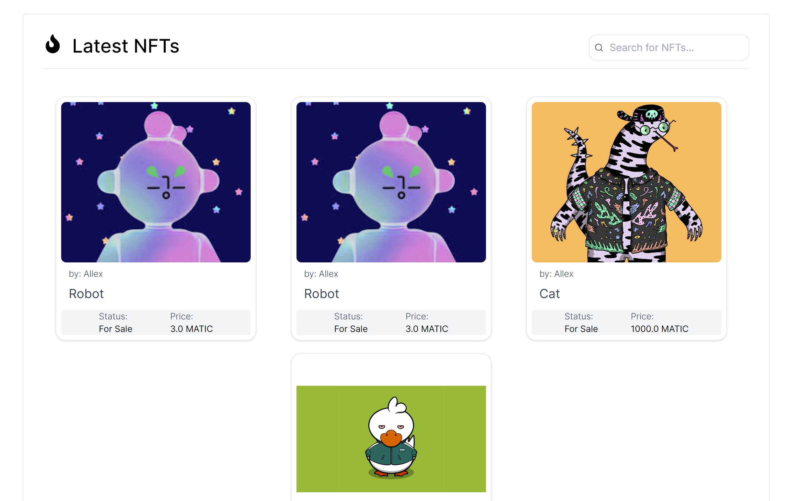
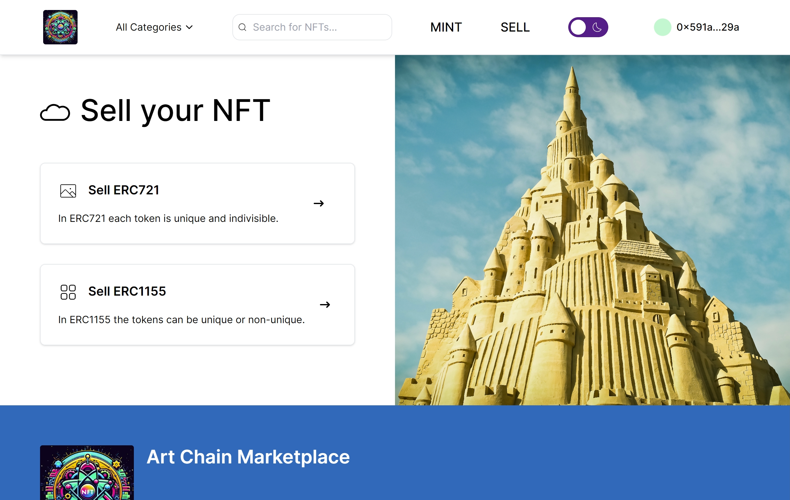
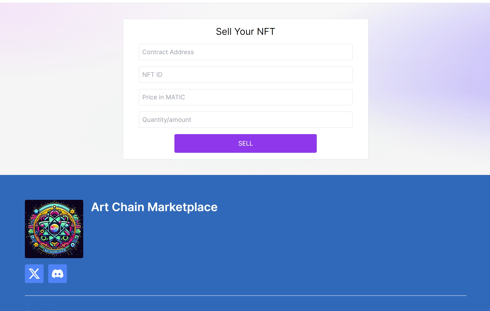
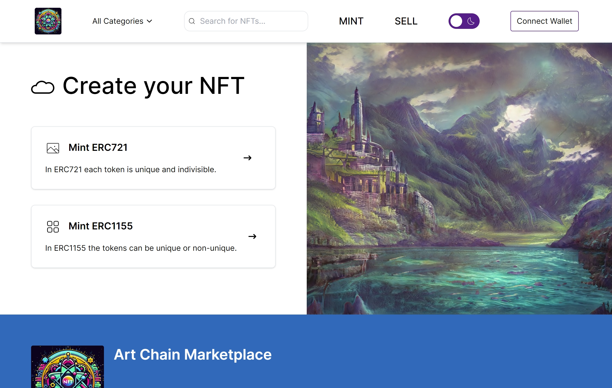
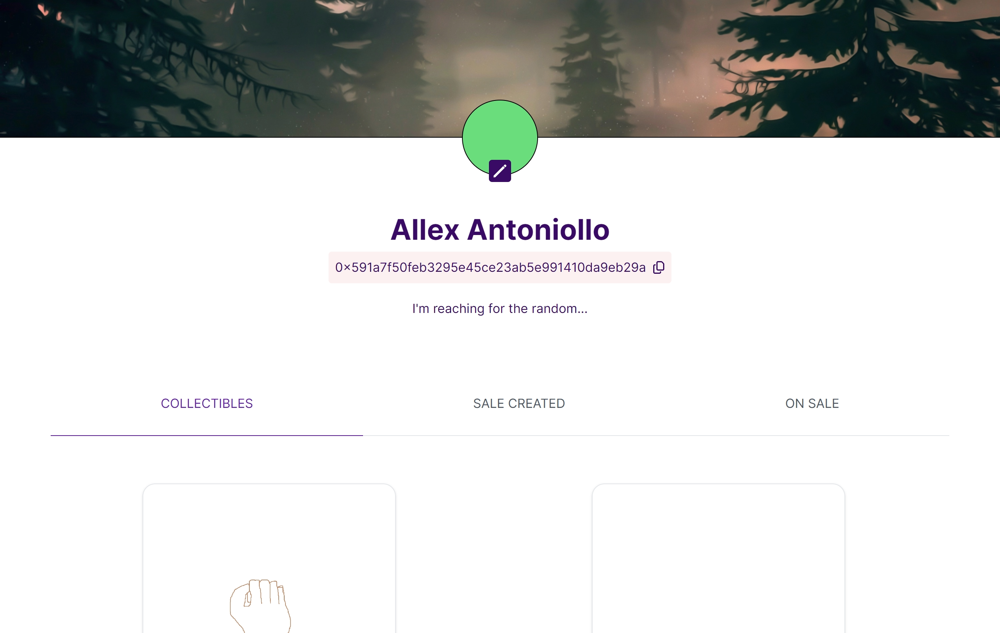

# ArtChain-MarketPlaceNFT

A Dapp of voluntary campaign, you can create a new campaign with a goal, or make donations to an existent campaign.

## Softwares

- [Next.js](https://nextjs.org/)
- [Solidity](https://soliditylang.org/)
- [Hardhat.js](https://hardhat.org/)
- [TypeScript](https://www.typescriptlang.org/)

## Contracts

Deployed in Sepolia network.

- ArtChain.sol MarketPlaceNFT

  Address: 0xCe285BcDDe89F90C72dE58C5A608e75b59174fD5
  https://sepolia.etherscan.io/address/0xCe285BcDDe89F90C72dE58C5A608e75b59174fD5#code

- ArtChainNFT.sol ERC721

  Address: 0x3F39888AaF83A31b8F76a5923ffcA7102b75C690
  https://sepolia.etherscan.io/address/0x3F39888AaF83A31b8F76a5923ffcA7102b75C690#code

- ArtChainNFT2.sol ERC1155

  Address: 0xd97EB95fF7F21001F0d0484E47B677Fe3fbf4B0B
  https://sepolia.etherscan.io/address/0xd97EB95fF7F21001F0d0484E47B677Fe3fbf4B0B#code

## Author

- Allex Antoniollo

## Screenshots

